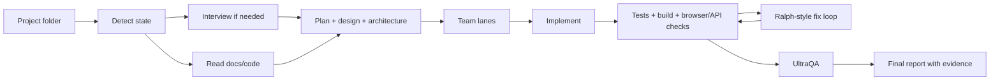

<div align="center">
  

  <h1>OMX Prompts</h1>

  <p>
    <strong>Autonomous product-delivery prompts for OpenAI Codex + oh-my-codex.</strong>
  </p>

  <p>
    Build from empty folders, ship from docs, improve existing apps, redesign frontends, harden QA, review security, and produce final evidence.
  </p>

  <p>
    <a href="https://platform.openai.com/docs/codex"></a>
    <a href="https://oh-my-codex.dev/docs.html"></a>
    <a href="https://github.com/SomeMedic/omx-prompts"></a>
  </p>

  <p>
    <a href="https://github.com/SomeMedic/omx-prompts/stargazers"></a>
    <a href="https://github.com/SomeMedic/omx-prompts/releases/tag/v0.1.0"></a>
    
    
    
  </p>

  <p>
    <a href="#quick-start">Quick Start</a>
    ·
    <a href="#choose-a-prompt">Choose A Prompt</a>
    ·
    <a href="#examples">Examples</a>
    ·
    <a href="./INSTRUCTIONS.md">Full Guide</a>
  </p>
</div>

---

## What This Is

**OMX Prompts** is a curated set of long-form operating prompts for running Codex like a small autonomous product team.

The prompts are designed to make Codex:

- inspect the local project before asking questions
- interview you only when the goal is genuinely under-specified
- create product/design/architecture/test documentation when needed
- use Team mode for parallel specialist lanes
- use Ralph-style loops for persistent fix/verify work
- run UltraQA before final completion
- produce final reports with verification evidence

> If this saves you setup time or helps Codex ship more complete work, a star helps other builders find it.

## Quick Start

Install Codex and OMX:

```bash
npm install -g @openai/codex oh-my-codex
omx setup --scope user --merge-agents
omx doctor
```

Start from a project folder:

```bash
cd /path/to/project
git init
codex
```

Paste the most universal prompt:

```text
omx-super-universal-autonomous-delivery-prompt.md
```

Fill only the important placeholders. Leave the rest as `AUTO_DETECT`, `AUTO_DECIDE`, or `UNKNOWN` if you want Codex to infer from context.

Need the complete setup guide? Read [`INSTRUCTIONS.md`](./INSTRUCTIONS.md).

## Choose A Prompt

| Situation | Use |
|---|---|
| One prompt for almost anything | [`omx-super-universal-autonomous-delivery-prompt.md`](./omx-super-universal-autonomous-delivery-prompt.md) |
| Build a full product from docs | [`universal-codex-product-development-prompt.md`](./universal-codex-product-development-prompt.md) |
| Generate a project-specific `AGENTS.md` | [`generate-agents-md-prompt.md`](./generate-agents-md-prompt.md) |
| Copy a ready `AGENTS.md` contract | [`AGENTS.template.md`](./AGENTS.template.md) |
| Redesign an existing frontend | [`omx-frontend-redesign-apply-prompt.md`](./omx-frontend-redesign-apply-prompt.md) |
| Implement a feature from a spec | [`omx-feature-from-spec-prompt.md`](./omx-feature-from-spec-prompt.md) |
| Integrate an external API | [`omx-api-integration-prompt.md`](./omx-api-integration-prompt.md) |
| Design schema/data/migrations | [`omx-database-data-model-prompt.md`](./omx-database-data-model-prompt.md) |
| Fix a bug with root-cause analysis | [`omx-bugfix-root-cause-prompt.md`](./omx-bugfix-root-cause-prompt.md) |
| Add tests and QA confidence | [`omx-test-and-qa-hardening-prompt.md`](./omx-test-and-qa-hardening-prompt.md) |
| Review security-sensitive areas | [`omx-security-review-hardening-prompt.md`](./omx-security-review-hardening-prompt.md) |
| Optimize performance | [`omx-performance-optimization-prompt.md`](./omx-performance-optimization-prompt.md) |
| Prepare for production readiness | [`omx-production-hardening-prompt.md`](./omx-production-hardening-prompt.md) |
| Prepare a release candidate | [`omx-release-readiness-prompt.md`](./omx-release-readiness-prompt.md) |
| Create docs, onboarding, runbooks | [`omx-docs-onboarding-runbook-prompt.md`](./omx-docs-onboarding-runbook-prompt.md) |
| Turn rough notes into a PRD | [`omx-product-discovery-prd-prompt.md`](./omx-product-discovery-prd-prompt.md) |
| Audit a codebase | [`omx-codebase-audit-and-refactor-plan-prompt.md`](./omx-codebase-audit-and-refactor-plan-prompt.md) |

For a more detailed decision tree, see [`docs/PROMPT_SELECTION_GUIDE.md`](./docs/PROMPT_SELECTION_GUIDE.md).

## The Main Prompt

[`omx-super-universal-autonomous-delivery-prompt.md`](./omx-super-universal-autonomous-delivery-prompt.md) is the default choice.

It handles:

- empty folder -> interview -> documentation -> implementation
- docs-first project -> full implementation
- existing app -> feature/module/integration/redesign
- maintenance work -> bugfix, QA, security, performance, production, release
- unclear request -> inspect first, then ask one focused question at a time

## Workflow



## Examples

Filled placeholder examples live in [`examples/`](./examples):

- [`empty-project-to-product.md`](./examples/empty-project-to-product.md)
- [`docs-to-full-product.md`](./examples/docs-to-full-product.md)
- [`existing-app-feature.md`](./examples/existing-app-feature.md)
- [`frontend-redesign.md`](./examples/frontend-redesign.md)
- [`api-integration.md`](./examples/api-integration.md)
- [`qa-hardening.md`](./examples/qa-hardening.md)
- [`security-hardening.md`](./examples/security-hardening.md)

## What Good Completion Looks Like

A good Codex/OMX run should end with:

- working code
- updated docs
- tests or justified test gaps
- build/lint/typecheck evidence
- browser/API verification where relevant
- QA findings and fixes
- security review where relevant
- `FINAL_REPORT.md` or task-specific report with traceability

If the result is only a plan, scaffold, fake UI, dead links, or vague “done” summary, the prompt did not finish the job.

## Repository Guide

| File | Purpose |
|---|---|
| [`INSTRUCTIONS.md`](./INSTRUCTIONS.md) | Full setup and usage guide |
| [`CONTRIBUTING.md`](./CONTRIBUTING.md) | Contribution rules and prompt quality bar |
| [`ROADMAP.md`](./ROADMAP.md) | Planned prompt library improvements |
| [`CHANGELOG.md`](./CHANGELOG.md) | Release notes |
| [`docs/PROMPT_QUALITY_CHECKLIST.md`](./docs/PROMPT_QUALITY_CHECKLIST.md) | Checklist for writing/reviewing prompts |
| [`showcase/`](./showcase) | Field reports from real Codex/OMX runs |
| [`assets/social-preview.png`](./assets/social-preview.png) | GitHub social preview image |

## Community

- Request a new prompt with the `Prompt request` issue template.
- Improve an existing prompt with the `Prompt improvement` template.
- Share real results with the `Showcase / field report` template.
- Join the welcome discussion: [Welcome to OMX Prompts](https://github.com/SomeMedic/omx-prompts/discussions/5).

## Safety

These prompts give Codex a lot of autonomy. Use them inside git repositories and commit important work before long autonomous runs.

The prompts are designed to ask before:

- destructive actions
- production deployment
- paid external service usage
- missing credentials
- irreversible product/business decisions

## License

MIT. Use, modify, and adapt these prompts for your own projects.
