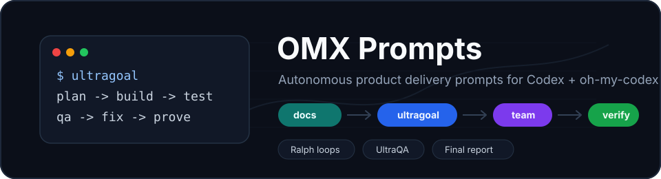
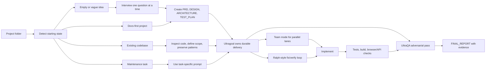

<div align="center">
  

  <h1>OMX Prompts</h1>

  <p>
    <strong>Long-form operating prompts for autonomous product delivery with Codex + oh-my-codex.</strong>
  </p>

  <p>
    <a href="https://platform.openai.com/docs/codex"></a>
    <a href="https://oh-my-codex.dev/docs.html"></a>
    <a href="https://github.com/SomeMedic/omx-prompts"></a>
  </p>

  <p>
    <a href="https://github.com/SomeMedic/omx-prompts/stargazers"></a>
    <a href="https://github.com/SomeMedic/omx-prompts/commits/main"></a>
    
    
    
    
  </p>

  <p>
    <a href="#quick-start">Quick Start</a>
    ·
    <a href="#prompt-file-catalog">Prompt Catalog</a>
    ·
    <a href="#which-prompt-should-i-use">Choose A Prompt</a>
    ·
    <a href="#troubleshooting">Troubleshooting</a>
  </p>
</div>

---

A practical prompt library for building, improving, auditing, testing, redesigning, and hardening software projects with OpenAI Codex and oh-my-codex (OMX).

This repository is designed for a very specific workflow:

1. Open a project folder in Codex.
2. Choose the right prompt from this repository.
3. Replace a small number of placeholders.
4. Paste the prompt into Codex.
5. Let OMX coordinate planning, design, implementation, tests, QA, repair loops, and final verification.

The prompts are intentionally long. They are not chat snippets. They are operating contracts for autonomous software delivery.

## Quick Start

```bash
npm install -g @openai/codex oh-my-codex
omx setup --scope user --merge-agents
omx doctor
mkdir my-product
cd my-product
git init
codex
```

Then paste:

```text
omx-super-universal-autonomous-delivery-prompt.md
```

For the first run, fill only the essential placeholders:

```text
{{PROJECT_OR_TASK_NAME}}
{{INITIAL_GOAL_OR_UNKNOWN}}
{{DESIRED_OUTCOME}}
```

Leave the rest as `AUTO_DETECT`, `AUTO_DECIDE`, or `UNKNOWN` if you want Codex to infer from context.

## What This Repository Is For

Use this repository when you want Codex + OMX to work like a small product team:

- product manager
- project manager
- UX researcher
- designer
- architect
- frontend developer
- backend developer
- full-stack implementer
- integration engineer
- database engineer
- test engineer
- QA tester
- verifier
- security reviewer
- performance reviewer
- documentation writer

The main idea is simple:

- `Ultragoal` owns durable goal state and final completion proof.
- `Team` handles coordinated parallel work when the task is broad.
- `Ralph-style loops` handle persistent sequential fix/verify cycles.
- `UltraQA` performs adversarial final review before completion.

The prompts in this repository explicitly tell Codex when to use each of those modes.

## Workflow Map



## Who This Is For

This repository is useful if you:

- build products from scratch with Codex
- start from documentation and want full implementation
- have an empty project folder and need Codex to interview you first
- maintain existing apps and want robust feature implementation
- want high-quality frontend redesigns applied to real code
- want QA, security, performance, or production-readiness passes
- want agents to stop asking routine questions and keep working autonomously
- want final reports with verification evidence instead of vague "done" claims

## Requirements

You need:

- Git
- Node.js and npm
- OpenAI Codex CLI
- oh-my-codex (OMX)
- A working OpenAI/Codex account/session
- Optional but recommended: Rust/Cargo, because some OMX exploration tooling can use it

On macOS, Linux, or WSL, the basic setup is similar.

## Visual Assets And Badges

This README intentionally uses lightweight open web assets instead of heavy decorative screenshots:

- Badges are generated with [Shields.io](https://shields.io/).
- The hero image is a local SVG committed to this repository, so it does not depend on a third-party image CDN.
- Badge logos use Shields.io logo support, which is based on common open icon sources such as Simple Icons.
- Product links point to the official [OpenAI Codex docs](https://platform.openai.com/docs/codex), the OpenAI [Introducing Codex](https://openai.com/index/introducing-codex/) page, and [oh-my-codex docs](https://oh-my-codex.dev/docs.html).

The visual style is deliberately minimal: a local SVG hero, badges, and a workflow diagram. No stock imagery, no oversized banners, no fake screenshots.

## Install Codex CLI

Install the OpenAI Codex CLI globally:

```bash
npm install -g @openai/codex
```

Verify it:

```bash
codex --version
```

If you use the Codex desktop app on macOS and the CLI exists inside the app bundle but is not on your shell `PATH`, make sure your terminal can run `codex`.

For example, if your working Codex binary is here:

```text
/Applications/Codex.app/Contents/Resources/codex
```

then your shell must still be able to resolve:

```bash
codex --version
```

OMX expects the Codex CLI to be callable from the shell environment where you run it.

## Install OMX

Install oh-my-codex globally:

```bash
npm install -g oh-my-codex
```

Verify the CLI:

```bash
omx --version
```

Then run setup:

```bash
omx setup --scope user --merge-agents
```

The recommended first setup mode is `--merge-agents`, because it preserves your existing Codex guidance while adding OMX-managed sections.

After setup, verify everything:

```bash
omx doctor
```

You want:

```text
All checks passed! oh-my-codex is ready.
```

Warnings are not always fatal, but they should be read carefully. A missing Codex CLI is a real problem. Missing project state in a brand-new folder is usually normal until OMX has created `.omx/` state.

## Recommended Global OMX Setup Flow

Use this once per machine:

```bash
npm install -g @openai/codex
npm install -g oh-my-codex
omx setup --scope user --merge-agents
omx doctor
```

If setup says your user `AGENTS.md` has been overwritten or lacks OMX markers, prefer:

```bash
omx setup --scope user --merge-agents
```

Use force only when you intentionally want OMX to replace managed sections:

```bash
omx setup --scope user --force
```

## Starting A New Product From Scratch

Create a new project folder:

```bash
mkdir my-product
cd my-product
git init
```

If you already have documentation, put it in `docs/`:

```text
my-product/
  docs/
    00-product-brief.md
    01-prd.md
    02-user-flows.md
    03-design-requirements.md
    04-technical-requirements.md
    05-acceptance-criteria.md
    06-test-plan.md
```

If you do not have documentation, use the super-universal prompt. It will detect the empty folder and interview you one question at a time.

Start Codex from the project root:

```bash
codex
```

Then paste one prompt from this repository.

## Starting From Existing Documentation

If your folder has documentation but no implementation:

1. Put docs in `./docs`.
2. Optionally copy `AGENTS.template.md` into the project as `AGENTS.md`.
3. Start Codex in the project root.
4. Paste `universal-codex-product-development-prompt.md` or `omx-super-universal-autonomous-delivery-prompt.md`.

The prompt will tell Codex to:

- read all docs
- extract requirements
- resolve conflicts
- create product/design/architecture/test artifacts
- build the application
- run verification
- fix failures
- run UltraQA
- produce a final report

## Starting In An Existing Project

For an existing app:

```bash
cd /path/to/existing-project
codex
```

Then choose a task-specific prompt:

- feature work: `omx-feature-from-spec-prompt.md`
- redesign: `omx-frontend-redesign-apply-prompt.md`
- bugfix: `omx-bugfix-root-cause-prompt.md`
- QA/test hardening: `omx-test-and-qa-hardening-prompt.md`
- security: `omx-security-review-hardening-prompt.md`
- performance: `omx-performance-optimization-prompt.md`
- production readiness: `omx-production-hardening-prompt.md`
- release readiness: `omx-release-readiness-prompt.md`
- docs/runbooks: `omx-docs-onboarding-runbook-prompt.md`
- data model: `omx-database-data-model-prompt.md`
- integration: `omx-api-integration-prompt.md`
- anything broad or unclear: `omx-super-universal-autonomous-delivery-prompt.md`

The prompts are written to make Codex inspect the repository before asking you questions.

## How To Use Placeholders

Every prompt contains placeholders like:

```text
{{PROJECT_NAME}}
{{DOCS_PATH}}
{{DESIRED_STYLE_DESCRIPTION_OR_REFERENCE_APPS}}
{{FEATURE_NAME}}
{{BUG_SUMMARY}}
```

Replace only what matters.

It is fine to leave some placeholders as `AUTO_DETECT`, `UNKNOWN`, or `AUTO_DECIDE` if you want Codex to infer them from local context.

Example:

```text
- Project or task name: Customer Portal
- Initial goal or idea: Build a client dashboard for invoices, messages, documents, and support requests
- Desired outcome: FULL_PRODUCT
- Documentation path: ./docs
- Preferred stack: AUTO_DECIDE
- Target users: B2B customers
- Business/product goal: Reduce support workload and give customers self-service access
- Desired design style if frontend: Linear-like calm SaaS UI with Stripe-level polish and dense dashboard ergonomics
```

## Prompt File Catalog

### `omx-super-universal-autonomous-delivery-prompt.md`

The most universal prompt in the repository.

Use it when you are unsure which prompt to choose.

It handles:

- empty folder
- vague product idea
- docs-only project
- partially built project
- existing app
- new feature
- integration
- module
- frontend block
- redesign
- bugfix
- refactor
- QA
- performance
- security
- production hardening
- release readiness

It starts by detecting the project state:

- empty or nearly empty
- docs exist but implementation is missing
- existing app/project
- existing project plus a specific requested change
- unclear existing-project request
- maintenance-only task

If the folder is empty and the idea is vague, it interviews you one question at a time.

If the docs or code are enough, it proceeds without unnecessary questions.

This is the best default prompt for "build or improve anything with maximum autonomy."

### `universal-codex-product-development-prompt.md`

Use this for building a full product from scratch when you already have at least some product direction or documentation.

It is focused on:

- product requirements
- design
- architecture
- implementation
- tests
- QA
- security-sensitive review
- final report

Compared with the super-universal prompt, this one is more directly optimized for full product development rather than any possible task.

### `AGENTS.template.md`

A ready-to-copy `AGENTS.md` template.

Use it inside any project where you want Codex and OMX agents to follow a strong operating contract.

It defines:

- source-of-truth rules
- autonomy policy
- true blockers
- Definition of Done
- required work loop
- team role expectations
- frontend standards
- backend/API standards
- security standards
- testing standards
- final report expectations

Typical usage:

```bash
cp "/path/to/omx-prompts/AGENTS.template.md" ./AGENTS.md
```

Then edit the top-level details for your project if needed.

### `generate-agents-md-prompt.md`

Use this when you want Codex to generate a custom `AGENTS.md` for an existing repository.

Instead of copying the generic template, paste this prompt into Codex from the target repo.

Codex will inspect:

- README
- docs
- package files
- source structure
- tests
- scripts
- framework conventions
- risky areas

Then it creates a project-specific `AGENTS.md`.

Best for existing codebases.

### `omx-frontend-redesign-apply-prompt.md`

Use this when you have an existing frontend and want Codex to design and apply a new visual/UX direction.

The main placeholder is:

```text
{{DESIRED_STYLE_DESCRIPTION_OR_REFERENCE_APPS}}
```

Examples:

```text
Linear-like calm SaaS interface, dense but elegant, with subtle borders, excellent keyboard-friendly workflows, and Stripe-level polish.
```

```text
Airbnb-inspired travel browsing UI with strong imagery, warm details, map/list exploration, mobile-first search, and polished empty states.
```

```text
Vercel/Next.js dashboard feel, high contrast, clean technical typography, compact navigation, excellent deployment/status surfaces.
```

The prompt tells Codex to:

- inspect the current frontend
- identify routes/components/styling system
- create or update `DESIGN.md`
- build a design system
- apply the redesign in code
- preserve existing behavior
- run browser verification
- produce `REDESIGN_REPORT.md`

Use it when the app works but looks weak, inconsistent, generic, or unfinished.

### `omx-feature-from-spec-prompt.md`

Use this for implementing a feature end to end from a spec.

Good for:

- new screens
- new product workflows
- new backend behavior
- new dashboard sections
- new user/account flows
- new admin tools
- new API-backed UI

It creates `FEATURE_PLAN.md`, implements the feature, adds tests, performs QA, and writes `FEATURE_REPORT.md`.

### `omx-api-integration-prompt.md`

Use this for external service integrations.

Good for:

- Stripe
- OpenAI API
- Google Maps
- email providers
- S3/storage
- CRM APIs
- analytics providers
- webhooks
- payment processors
- third-party data APIs

It emphasizes:

- client/adapter boundaries
- env vars
- missing credential handling
- safe local/mock mode
- no secrets in code
- failure handling
- tests
- integration report

Use this when real external APIs are involved and you do not want Codex to fake production completion.

### `omx-database-data-model-prompt.md`

Use this when the main work is schema, data model, migrations, seed data, or persistence behavior.

Good for:

- new entities
- relational modeling
- ownership/tenant rules
- migrations
- seed/demo data
- ORM cleanup
- data lifecycle states
- indexes and constraints

It creates `DATA_MODEL.md` and `DATA_MODEL_REPORT.md`.

### `omx-bugfix-root-cause-prompt.md`

Use this for bugs.

It forces a root-cause-first workflow:

- reproduce or simulate
- trace expected vs actual behavior
- find the fault boundary
- fix the smallest durable cause
- add regression coverage
- verify adjacent behavior
- write `BUGFIX_REPORT.md`

Use this when you want Codex to stop guessing and actually diagnose.

### `omx-test-and-qa-hardening-prompt.md`

Use this when the app exists but quality confidence is low.

It improves:

- unit tests
- integration tests
- e2e/smoke tests
- QA checklists
- regression coverage
- verification scripts

It creates or updates `TEST_PLAN.md`, `QA_CHECKLIST.md`, and `QA_HARDENING_REPORT.md`.

Use this before relying on an app generated by AI.

### `omx-security-review-hardening-prompt.md`

Use this for security-sensitive review and local hardening.

It checks:

- auth
- roles
- permissions
- secrets
- env vars
- PII
- file uploads
- webhooks
- payments
- injection risks
- unsafe IO/network behavior
- CORS/session/cookie behavior where relevant

It creates `SECURITY_REVIEW.md`, `SECURITY_HARDENING_PLAN.md`, and `SECURITY_REPORT.md`.

Use it before production or before adding users to an app.

### `omx-performance-optimization-prompt.md`

Use this when performance matters.

It is measurement-first:

- baseline
- bottleneck diagnosis
- targeted changes
- before/after evidence
- correctness verification

Good for:

- slow pages
- slow APIs
- large tables
- render problems
- bundle size
- database query problems
- startup time
- build time

It creates `PERFORMANCE_BASELINE.md` and `PERFORMANCE_REPORT.md`.

### `omx-production-hardening-prompt.md`

Use this when the app works locally but needs production-shaped readiness.

It improves:

- env docs
- startup reliability
- build scripts
- health/smoke paths
- `.env.example`
- README setup
- operational notes
- safe defaults
- local production-readiness evidence

It does not deploy production by default.

It creates `PRODUCTION_READINESS.md` and `PRODUCTION_HARDENING_REPORT.md`.

### `omx-release-readiness-prompt.md`

Use this before a release.

It checks:

- build
- tests
- smoke flows
- migration notes
- env vars
- release blockers
- rollback notes
- release notes
- go/no-go status

It creates `RELEASE_READINESS.md` and `RELEASE_NOTES.md`.

It does not deploy by default.

### `omx-docs-onboarding-runbook-prompt.md`

Use this when documentation is missing, stale, or insufficient.

It creates or updates:

- README
- onboarding docs
- architecture docs
- development docs
- testing docs
- troubleshooting docs
- runbooks
- `.env.example`

It verifies commands where feasible and writes `DOCS_REPORT.md`.

Use it when a project is hard to understand or hard to run.

### `omx-product-discovery-prd-prompt.md`

Use this when you have rough notes but need a real PRD before building.

It creates:

- `PRD.md`
- `ACCEPTANCE_CRITERIA.md`
- `PRODUCT_PLAN.md`
- `REQUIREMENTS_TRACEABILITY.md`
- `PRODUCT_DISCOVERY_REPORT.md`

It does not implement code.

Use it when the product idea is still fuzzy and you want Codex to turn it into implementation-ready documentation.

### `omx-codebase-audit-and-refactor-plan-prompt.md`

Use this to audit a codebase and create a prioritized refactor plan.

It looks at:

- architecture
- maintainability
- duplication
- tests
- security-sensitive gaps
- performance hazards
- documentation
- developer experience

By default, it plans rather than refactors broadly.

It creates `CODEBASE_AUDIT.md` and `REFACTOR_PLAN.md`.

### `INSTRUCTIONS.md`

A compact guide for using the original universal product-development prompt.

It includes:

- recommended project structure
- placeholder explanation
- suggested `AGENTS.md` contract
- short launch variant
- pre-launch checklist

This file is useful as a quick reference.

## Which Prompt Should I Use?

Use this decision guide:

| Situation | Prompt |
|---|---|
| I want one prompt for anything | `omx-super-universal-autonomous-delivery-prompt.md` |
| I want to build a full product from docs | `universal-codex-product-development-prompt.md` |
| I have an empty folder and vague idea | `omx-super-universal-autonomous-delivery-prompt.md` |
| I need a custom AGENTS.md | `generate-agents-md-prompt.md` |
| I want a ready AGENTS.md template | `AGENTS.template.md` |
| I want to redesign an existing frontend | `omx-frontend-redesign-apply-prompt.md` |
| I want to implement a feature | `omx-feature-from-spec-prompt.md` |
| I want to integrate an external API | `omx-api-integration-prompt.md` |
| I want to design data models/migrations | `omx-database-data-model-prompt.md` |
| I need a bug fixed properly | `omx-bugfix-root-cause-prompt.md` |
| I want better tests and QA | `omx-test-and-qa-hardening-prompt.md` |
| I want security review/hardening | `omx-security-review-hardening-prompt.md` |
| I want performance improvements | `omx-performance-optimization-prompt.md` |
| I want production readiness | `omx-production-hardening-prompt.md` |
| I want release readiness | `omx-release-readiness-prompt.md` |
| I want docs and runbooks | `omx-docs-onboarding-runbook-prompt.md` |
| I want a PRD from rough notes | `omx-product-discovery-prd-prompt.md` |
| I want a codebase audit | `omx-codebase-audit-and-refactor-plan-prompt.md` |

## Recommended Workflow For A New Empty Project

1. Create a folder.

```bash
mkdir my-product
cd my-product
git init
```

2. Start Codex.

```bash
codex
```

3. Paste `omx-super-universal-autonomous-delivery-prompt.md`.

4. Fill the placeholders minimally:

```text
- Project or task name: My Product
- Initial goal or idea: I want a SaaS app that helps clinics manage patient follow-up tasks
- Desired outcome: FULL_PRODUCT
- Documentation path: AUTO_DETECT
- Preferred stack: AUTO_DECIDE
- Target users: clinic owners and care coordinators
- Business/product goal: reduce missed follow-ups
- Desired design style if frontend: calm clinical SaaS, dense dashboard, clean forms
```

5. Let Codex interview you if the product is under-specified.

6. After the interview, Codex should create docs, design, architecture, implementation, tests, QA evidence, and a final report.

## Recommended Workflow For A Docs-First Product

1. Put docs in `./docs`.
2. Add `AGENTS.md` or use `AGENTS.template.md`.
3. Commit the docs.

```bash
git add docs AGENTS.md
git commit -m "Add product documentation"
```

4. Start Codex.

```bash
codex
```

5. Paste `universal-codex-product-development-prompt.md` or `omx-super-universal-autonomous-delivery-prompt.md`.

6. Let Codex build, test, QA, and reconcile every requirement.

## Recommended Workflow For Existing Projects

1. Make sure you are in the project root.
2. Check git state.

```bash
git status
```

3. Start Codex.

```bash
codex
```

4. Choose a task-specific prompt.

5. Paste it and fill placeholders.

6. Codex should inspect the repository before asking questions.

7. For implementation tasks, Codex should verify with tests/build/browser/API checks before final completion.

## How The Prompts Control Autonomy

These prompts are designed to reduce manual steering.

They tell Codex:

- do not ask routine questions
- inspect local context first
- make reversible decisions
- document assumptions
- ask only for true blockers
- build real implementation
- run verification
- fix failures
- run UltraQA
- produce evidence

True blockers are things like:

- missing paid credentials
- destructive actions outside the project
- production deployment
- irreversible business decisions
- legal/compliance choices
- impossible requirements without external access

Everything else should usually be handled by Codex.

## Important Safety Notes

These prompts can give Codex a lot of autonomy.

Use that autonomy inside a git repository.

Recommended:

```bash
git init
git add .
git commit -m "Initial state"
```

Before running a long prompt, make sure:

- important files are committed or backed up
- credentials are not committed
- the project is not connected to production by default
- destructive actions require your approval
- external paid services are not used without permission

Do not ask an autonomous prompt to operate directly on production infrastructure unless you fully understand the risk.

## What Good Completion Looks Like

A good final result should include:

- working code
- updated docs
- tests or justified test gaps
- build/lint/typecheck results
- browser/API verification where relevant
- QA findings and fixes
- security-sensitive review where relevant
- a final report with evidence
- clear blockers if anything could not be completed

Bad completion looks like:

- only a plan
- only a scaffold
- fake buttons
- dead links
- placeholder screens
- mocked production behavior without documentation
- no tests
- no verification evidence
- vague "done" summary

The prompts in this repo are written to push Codex toward the first outcome.

## Troubleshooting

### `omx doctor` says Codex CLI is not found

Check:

```bash
which codex
codex --version
```

If missing, install:

```bash
npm install -g @openai/codex
```

Then rerun:

```bash
omx doctor
```

### `omx doctor` says skills or prompts are missing

Run:

```bash
omx setup --scope user --merge-agents
omx doctor
```

### Codex keeps asking too many questions

Use a stronger prompt, usually:

```text
omx-super-universal-autonomous-delivery-prompt.md
```

Make sure the prompt includes:

- autonomy level
- true blockers only
- make reversible decisions
- document assumptions
- continue until verified

### Codex stops after planning

Use a prompt that explicitly says:

- do not stop after planning
- implement the product
- run verification
- fix failures
- produce final report

The super-universal prompt and universal product-development prompt both include this.

### Codex makes a weak UI

Use:

```text
omx-frontend-redesign-apply-prompt.md
```

Give strong style guidance:

```text
Linear-like SaaS dashboard, dense and calm, excellent table/form ergonomics, subtle borders, restrained color, polished empty/error/loading states.
```

### Codex says it cannot finish because credentials are missing

That is often correct.

For missing external credentials, the expected behavior is:

- create adapter/client boundary
- create mock/local-safe mode
- document env vars
- test local mode
- mark real integration verification as blocked

Use `omx-api-integration-prompt.md` for this.

## Maintaining This Prompt Library

When adding new prompts:

1. Keep the prompt paste-ready.
2. Start with an OMX command such as `$ultragoal`.
3. Use placeholders clearly.
4. Include mission, discovery, implementation, verification, and final report sections.
5. Tell Codex when to ask questions and when to decide autonomously.
6. Include safety rules.
7. Include evidence requirements.
8. Update this README.

## Suggested Repository Layout

```text
omx-prompts/
  README.md
  INSTRUCTIONS.md
  AGENTS.template.md
  generate-agents-md-prompt.md
  universal-codex-product-development-prompt.md
  omx-super-universal-autonomous-delivery-prompt.md
  omx-frontend-redesign-apply-prompt.md
  omx-feature-from-spec-prompt.md
  omx-api-integration-prompt.md
  omx-database-data-model-prompt.md
  omx-bugfix-root-cause-prompt.md
  omx-test-and-qa-hardening-prompt.md
  omx-security-review-hardening-prompt.md
  omx-performance-optimization-prompt.md
  omx-production-hardening-prompt.md
  omx-release-readiness-prompt.md
  omx-docs-onboarding-runbook-prompt.md
  omx-product-discovery-prd-prompt.md
  omx-codebase-audit-and-refactor-plan-prompt.md
```

## Minimal First Run

If you want the fastest possible start:

```bash
npm install -g @openai/codex oh-my-codex
omx setup --scope user --merge-agents
omx doctor
mkdir my-product
cd my-product
git init
codex
```

Then paste:

```text
omx-super-universal-autonomous-delivery-prompt.md
```

Fill only:

```text
{{PROJECT_OR_TASK_NAME}}
{{INITIAL_GOAL_OR_UNKNOWN}}
{{DESIRED_OUTCOME}}
```

Leave the rest as `AUTO_DETECT`, `AUTO_DECIDE`, or `UNKNOWN` if you want Codex to infer it.

## License

Use, modify, and adapt these prompts for your own projects.
